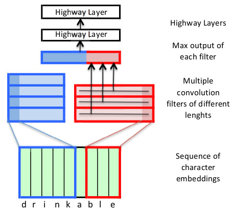
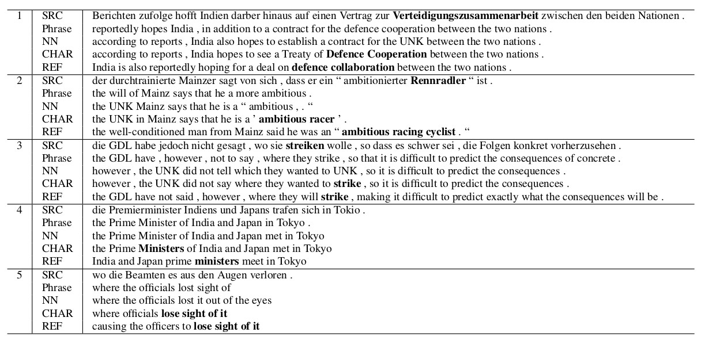

# Paper

- **Title**: Character-based Neural Machine Translation
- **Authors**: Marta R. Costa-Jussà, José A. R. Fonollosa
- **Link**: <http://arxiv.org/abs/1603.00810v3>
- **Tags**: Neural Network, machine translation
- **Year**: 2016

# Summary

- What

  - Most neural machine translation models currently operate on word vectors or one hot vectors of words.
  - They instead generate the vector of each word on a character-level.

    - Thereby, the model can spot character-similarities between words and treat them in a similar way.
    - They do that only for the source language, not for the target language.

- How

  - They treat each word of the source text on its own.
  - To each word they then apply the model from [Character-aware neural language models](https://arxiv.org/abs/1508.06615), i.e. they do per word:

    - Embed each character into a 620-dimensional space.
    - Stack these vectors next to each other, resulting in a 2d-tensor in which each column is one of the vectors (i.e. shape `620xN` for `N` characters).
    - Apply convolutions of size `620xW` to that tensor, where a few different values are used for `W` (i.e. some convolutions cover few characters, some cover many characters).
    - Apply a tanh after these convolutions.
    - Apply a max-over-time to the results of the convolutions, i.e. for each convolution use only the maximum value.
    - Reshape to 1d-vector.
    - Apply two highway-layers.
    - They get 1024-dimensional vectors (one per word).
    - Visualization of their steps:

      - 

  - Afterwards they apply the model from [Neural Machine Translation by Jointly Learning to Align and Translate](https://arxiv.org/abs/1409.0473) to these vectors, yielding a translation to a target language.

  - Whenever that translation yields an unknown target-language-word ("UNK"), they replace it with the respective (untranslated) word from the source text.

- Results

  - They the German-English [WMT](http://www.statmt.org/wmt15/translation-task.html) dataset.
  - BLEU improvemements (compared to neural translation without character-level words):

    - German-English improves by about 1.5 points.
    - English-German improves by about 3 points.

  - Reduction in the number of unknown target-language-words (same baseline again):

    - German-English goes down from about 1500 to about 1250.
    - English-German goes down from about 3150 to about 2650.

  - Translation examples (Phrase = phrase-based/non-neural translation, NN = non-character-based neural translation, CHAR = theirs):

    - 
